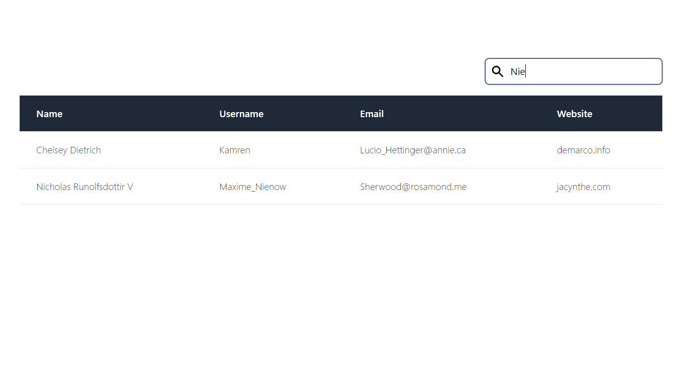

# User data filtering story

As an anonymous user I want to see a set of users shows in a table. In addition I want to be
able to have an input field which filters the list of users for matching criteria e.g. enter the
name of a user “Franz” or “Fra” into the input field and the list updates to reflect only the
matching users with name “Franz”

Data used for the repo is fetched from [example API]https://jsonplaceholder.typicode.com/users

## Project setup

### Install dependencies

Install dependencies with `npm install`

### Start development environment

### `npm start`

Runs the app in the development mode.\
Open [http://localhost:3000](http://localhost:3000) to view it in the browser.

### `npm test`

Run unit tests with JEST.

### `npm run build`

Builds the app for production to the `build` folder.\
It correctly bundles React in production mode and optimizes the build for the best performance.

The build is minified and the filenames include the hashes.\
Your app is ready to be deployed!

## Screenshots

	

## How to modify table settings

To control which table columns are visible and which data columns are used for filtering user data go to file `src\features\Users\consts.ts`.

It has two constants that modify table setup:

FILTER_COLUMNS - controls which columns are used for data filtering when typing inside search box

TABLE_COLUMNS - controls which columns are shown to the user also allows to modify the column header name

